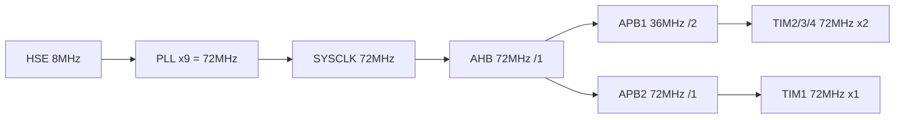

# 子Skill 2: 生成 02_硬件配置.md

> **职责**: 读取分析结果，生成硬件配置文档 — 这是整个知识库最关键的文档。
> **输入**: `_analysis/clock_tree.md`, `_analysis/gpio_and_pins.md`, `_analysis/peripheral_config.md`, `_analysis/nvic_priorities.md`, `_analysis/project_overview.md`
> **输出**: `02_硬件配置.md`

---

## 必须遵守的共享规则

开始前先读取:
- `shared/iron_rules.md` — 铁律规则（特别注意铁律1、2、4）
- `shared/format_spec.md` — 排版规范

---

## 执行前：判断运行模式

### 模式判断
1. 检查目标文档是否存在（`02_硬件配置.md`）
2. 存在 → **补厚模式**：读取现有文档，只补充缺失内容
3. 不存在 → **全新生成模式**：从零开始生成

### 补厚模式操作规则
- 读取现有文档，记录"已有哪些章节/内容"
- 与本子skill的"应有内容"对比，找出缺失项
- 只追加缺失内容，不修改已有内容
- 在追加内容前加注释：`<!-- 补充于 [日期] -->`（可选）
- 执行完成后输出操作摘要

### 数据读取规则（全新/补厚均适用）
1. 先读 `_analysis/clock_tree.md`、`_analysis/gpio_and_pins.md` 等 → 了解有哪些源文件需要读
2. 直接打开 `_v10_snapshot/sources/` 中的源文件
3. 从源码提取完整数据（数值必须有 源文件:行号 来源）
4. `_analysis/` 只作为导航，文档中所有数据来自源码

---

## 文档结构

### 1. 主控芯片

- 芯片型号 (**必须精确到系列，见铁律2**)、内核、Flash/RAM 大小
- **系统时钟** (来自 `_analysis/clock_tree.md`)
- **AHB/APB1/APB2 分频比**
- **时钟树用Mermaid图可视化**

**Mermaid时钟树示例**:

### 2. 外设资源使用总表

以表格形式列出**所有**被使用的外设（来自 `_analysis/peripheral_config.md`）:

| 外设 | 引脚 | 方向 | 参数 | 功能模块 | 源文件 | 确认度 |
|---|---|---|---|---|---|---|
| USARTx | PAx(TX)/PAx(RX) | 双向 | 波特率, 8N1 | 模块名 | 源文件:行号 | ✅代码确认 |
| GPIO | PC14 (GPIO_Pin_14) | 输出 | 推挽 | LED1 | hal_led.h:5 | ✅代码确认 |

> **引脚列必须写实际引脚名（如PC14），不能写宏名（如LED1_PIN）**。见铁律1。
> **引脚列必须标注证据来源（源文件:行号）**。见铁律4。
> 最后一列「确认度」标注该信息是代码确认(✅)还是需要硬件资料确认(⚠️)
> **禁止模糊描述外设接口**: 必须写明是"硬件SPI1"还是"软件SPI"，不能写"I2C/SPI"

### 3. 系统固定引脚

来自 `_analysis/gpio_and_pins.md`，包含:

| 引脚 | 功能 | 确认方式 |
|------|------|----------|
| PA13/PA14 | SWD (SWDIO/SWCLK) | 检查 `GPIO_Remap_SWJ_*` 配置确定实际模式 |
| OSC_IN/OSC_OUT | 外部晶振 | 检查 HSE 是否使用 |
| NRST | 复位 | 固定功能 |
| BOOT0 | 启动选择 | 固定功能 |

### 4. AFIO 重映射总结表

来自 `_analysis/gpio_and_pins.md` 的重映射段落:

| 重映射调用 | 类型 | 释放的引脚 | 占用/保留的引脚 | 源文件:行号 |
|-----------|------|-----------|--------------|------------|

### 5. 各外设详细配置

对每个外设写一个子节（数据来自 `_analysis/peripheral_config.md`）:
- 配置参数完整列出
- TX/RX 方式（DMA? 中断? 轮询?）
- 连接的外部器件型号
- 相关中断和优先级

### 6. NVIC 优先级汇总表

来自 `_analysis/nvic_priorities.md`:

| 中断源 | 设置的抢占优先级 | 设置的子优先级 | **实际生效值** | 源文件:行号 |
|---|---|---|---|---|
| TIM4 | 1 | 0 | (根据Group计算) | hal_timer.c:33 |

---

## 数据来源映射表

| 文档章节 | 主要数据来源 | 补充来源 |
|---------|------------|---------|
| 主控芯片 | `project_overview.md` + `clock_tree.md` | |
| 外设总表 | `peripheral_config.md` + `gpio_and_pins.md` | |
| 系统固定引脚 | `gpio_and_pins.md` | |
| AFIO重映射 | `gpio_and_pins.md` | |
| 外设详细配置 | `peripheral_config.md` | 源码回查 |
| NVIC表 | `nvic_priorities.md` | |

## 回查要求

如果 `_analysis/` 中的数据不完整（如缺少某个外设的引脚信息），必须回到 `_v10_snapshot/` 源码中搜索补充。回查后的补充数据也要标注源文件:行号。
