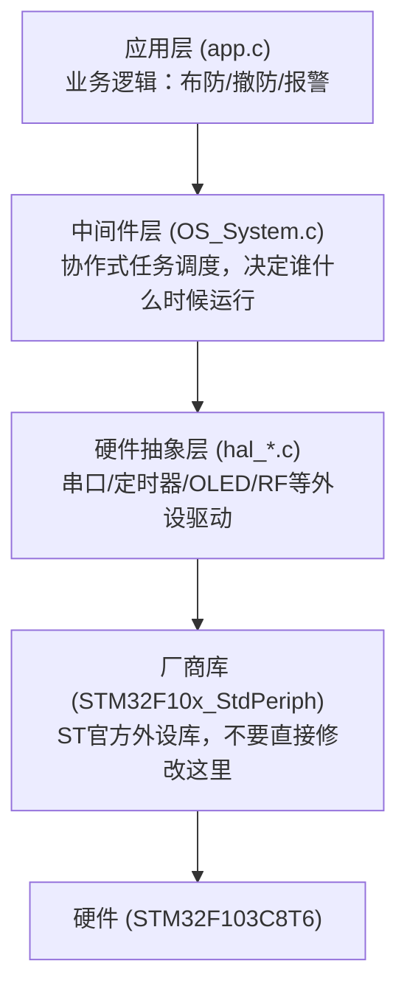
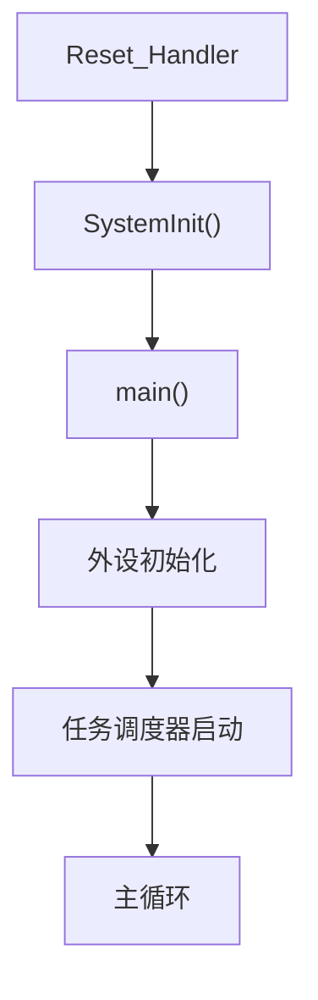
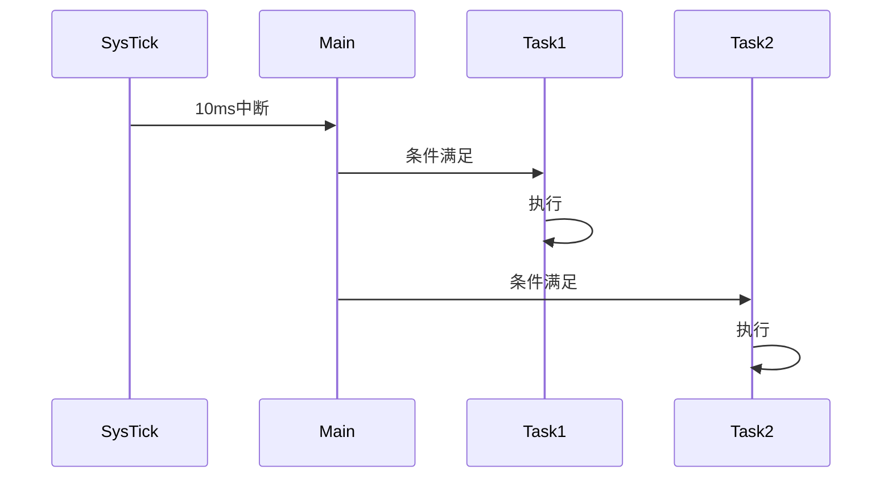

# 子Skill 3: 生成 03_系统架构.md

> **职责**: 读取分析结果，生成系统架构文档。
> **输入**: `_analysis/system_init_and_tasks.md`, `_analysis/memory_layout.md`, `_analysis/nvic_priorities.md`, `_analysis/clock_tree.md`
> **输出**: `03_系统架构.md`

---

## 必须遵守的共享规则

开始前先读取:
- `shared/iron_rules.md` — 铁律规则（特别注意铁律3"为什么"）
- `shared/format_spec.md` — 排版规范

---

## 执行前：判断运行模式

### 模式判断
1. 检查目标文档是否存在（`03_系统架构.md`）
2. 存在 → **补厚模式**：读取现有文档，只补充缺失内容
3. 不存在 → **全新生成模式**：从零开始生成

### 补厚模式操作规则
- 读取现有文档，记录"已有哪些章节/内容"
- 与本子skill的"应有内容"对比，找出缺失项
- 只追加缺失内容，不修改已有内容
- 在追加内容前加注释：`<!-- 补充于 [日期] -->`（可选）
- 执行完成后输出操作摘要

### 数据读取规则（全新/补厚均适用）
1. 先读 `_analysis/system_init_and_tasks.md` 等 → 了解有哪些源文件需要读
2. 直接打开 `_v10_snapshot/sources/` 中的源文件
3. 从源码提取完整数据（数值必须有 源文件:行号 来源）
4. `_analysis/` 只作为导航，文档中所有数据来自源码

---

## 文档结构

### 0. 软件分层架构总览（新人先看这里）

**必须有 Mermaid 分层架构图**（层次来自 include 依赖关系，不能靠猜）：



**要求**：
- 每个框：文件名 + 一句话功能描述
- 不超过5层
- 必须基于代码实际结构，不能用通用模板
- 层次来自 include 依赖关系，不能靠猜

**必须有各层职责说明表**：

| 层次 | 包含文件 | 职责 | 调用规则 |
|------|---------|------|---------|
| 应用层 | app.c | 业务逻辑 | 只能向下调用中间件和HAL |
| 中间件层 | OS_System.c, para.c | 调度+参数 | 只能调用HAL层 |
| HAL层 | hal_*.c | 外设驱动 | 只能调用厂商库 |
| 厂商库 | STM32F10x_StdPeriph | 寄存器操作 | 禁止跨层调用 |

**补厚模式**：如果 `03_系统架构.md` 已存在但缺少此章节，追加到文档开头。

### 1. OS/调度器类型

- RTOS? 协作式? 裸机? (来自 `_analysis/system_init_and_tasks.md`)
- **为什么选择这种调度方式** (铁律3)
- 如果是RTOS: 版本号、配置参数
- 如果是协作式: 调度机制描述

### 2. 启动流程

**必须包含 Mermaid flowchart**:



从 `_analysis/system_init_and_tasks.md` 的"启动顺序"章节提取数据。
每个节点必须标注源文件:行号。

### 3. 任务/线程划分

| 任务名 | 入口函数 | 周期 | 优先级 | 职责 | 来源 |
|--------|---------|------|--------|------|------|

**数据来源**: `_analysis/system_init_and_tasks.md`

### 4. 运行时任务调度时序图

用时间轴展示SysTick中断触发后各任务的执行顺序和时间关系，标注中断嵌套关系。

**Mermaid sequenceDiagram 示例**:


### 5. 中断优先级配置

来自 `_analysis/nvic_priorities.md`:
- 优先级分组设置
- 各中断的实际生效优先级
- 潜在的优先级冲突分析

### 6. 内存布局

来自 `_analysis/memory_layout.md`:

#### Flash分区图

```
+-------------------+  0x08000000
|   Bootloader      |  (如有)
+-------------------+  0x0800XXXX
|   Application     |
+-------------------+  0x0803FFFF
```

#### RAM使用率估算

| 模块 | 全局/静态变量 | 估算大小 |
|------|------------|---------|
| ... |
| **合计** | | **XX KB / YY KB (ZZ%)** |

#### Stack/Heap大小

**必须从startup文件提取，不写"需确认"**

### 7. Bootloader 信息（如有）

- 偏移地址
- 跳转方式
- **偏移地址计算依据** (铁律3)

---

## 数据来源映射表

| 文档章节 | 主要数据来源 |
|---------|------------|
| 调度器类型 | `system_init_and_tasks.md` |
| 启动流程 | `system_init_and_tasks.md` |
| 任务划分 | `system_init_and_tasks.md` |
| 中断优先级 | `nvic_priorities.md` |
| 内存布局 | `memory_layout.md` |
| Bootloader | `memory_layout.md` + `system_init_and_tasks.md` |
