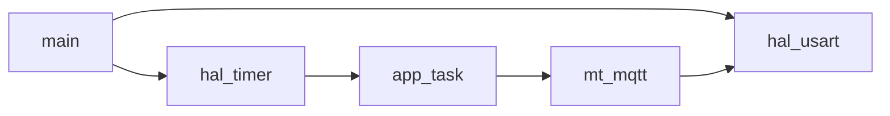

# 子Skill 4: 生成 04_功能模块.md

> **职责**: 读取分析结果，生成功能模块详细文档。
> **输入**: `_analysis/module_analysis.md`, `_analysis/peripheral_config.md`, `_analysis/data_structures.md`, `_v10_context/call_graph_hint.json`
> **输出**: `04_功能模块.md`

---

## 必须遵守的共享规则

开始前先读取:
- `shared/iron_rules.md` — 铁律规则
- `shared/format_spec.md` — 排版规范

---

## 执行前：判断运行模式

### 模式判断
1. 检查目标文档是否存在（`04_功能模块.md`）
2. 存在 → **补厚模式**：读取现有文档，只补充缺失内容
3. 不存在 → **全新生成模式**：从零开始生成

### 补厚模式操作规则
- 读取现有文档，记录"已有哪些章节/内容"
- 与本子skill的"应有内容"对比，找出缺失项
- 只追加缺失内容，不修改已有内容
- 在追加内容前加注释：`<!-- 补充于 [日期] -->`（可选）
- 执行完成后输出操作摘要

### 数据读取规则（全新/补厚均适用）
1. 先读 `_analysis/module_analysis.md` 等 → 了解有哪些源文件需要读
2. 直接打开 `_v10_snapshot/sources/` 中的源文件
3. 从源码提取完整数据（数值必须有 源文件:行号 来源）
4. `_analysis/` 只作为导航，文档中所有数据来自源码

---

## 文档结构

### 模块清单速查表（先看这里）

在文档开头提供全部模块的一览表：

| 模块 | 文件 | 一句话职责（新人能看懂）| 初始化函数 | 主处理函数 |
|------|------|-----------------------|-----------|------------|
| 业务逻辑 | app.c | 实现布防/撤防/报警的核心状态机 | `app_Init()` | `app_TaskRun()` |
| 任务调度 | OS_System.c | 决定哪个任务在什么时候运行 | `OS_Init()` | `OS_TaskRun()` |
| ... | ... | ... | ... | ... |

**要求**：
- 覆盖所有业务 .c 文件（排除第三方库）
- 职责描述必须用非技术语言（假设读者刚毕业入职）
- 函数名必须是真实存在的，来自源码
- 导航索引来源: `_analysis/module_analysis.md`（仅用于定位源文件，数据必须从源码提取，函数名须验证真实性）

**补厚模式**：如果 `04_功能模块.md` 已存在但缺少该表，在文档开头追加。

---

### 每个业务模块一个章节

导航索引来源: `_analysis/module_analysis.md`（仅导航，模块详细数据必须从 `_v10_snapshot/sources/` 源码提取）

对每个模块包含:

#### [模块名] (xxx.c)

- **职责**: 一句话说明
- **所在文件**: xxx.c + xxx.h
- **代码行数**: ~X行
- **初始化函数**: xxx_Init() (来源: xxx.c:行号)
- **主循环函数**: xxx_Process() (来源: xxx.c:行号)

##### 对外 API 列表 (Public)

被其他模块调用的公开函数:

| 函数名 | 参数 | 返回值 | 功能 | 来源 |
|--------|------|--------|------|------|

##### 内部函数列表 (Private)

仅模块内使用的内部函数:

| 函数名 | 调用者/触发方式 | 功能概述 | 来源 |
|--------|---------------|---------|------|
| xxxConfig | xxx_Init调用 | GPIO/外设硬件配置 | xxx.c:行号 |
| xxxHandle | 定时器回调(T_XXX) | 周期性中断上下文处理 | xxx.c:行号 |
| xxxDrive | xxxHandle调用 | 底层GPIO/寄存器操作 | xxx.c:行号 |
| XXX_IRQHandler | 中断触发 | ISR入口 | xxx.c:行号 |

> **注意**: 内部函数也必须全部列出——这些函数包含了硬件配置细节和核心算法实现，对理解模块至关重要。

##### 依赖的其他模块

列出该模块调用了哪些其他模块的函数。

##### 核心状态机/算法描述

如果模块有状态机，用文字描述 + Mermaid图（如适用）。

##### 关键数据流链路描述

例如: "报警触发完整链路: 门磁→RF解码→匹配→模式判断→喇叭→MQTT上报"

### 大模块特殊处理 (app.c 等)

对于超过500行的大文件，按功能子区域组织:

```markdown
## app — 安防系统应用层 (app.c)

### 系统模式处理

| 函数名 | 对应模式 | 功能 | 来源 |
|--------|---------|------|------|
| S_ENArmModeProc | 离家布防 | 布防报警处理 | app.c:137 |
| S_DisArmModeProc | 撤防 | 撤防状态处理 | app.c:248 |
| S_HomeArmModeProc | 在家布防 | 在家布防处理 | app.c:338 |
| S_AlarmModeProc | 报警中 | 报警声光控制 | app.c:425 |
| SystemMode_Change | 模式切换 | 模式转换逻辑 | app.c:101 |

### 菜单系统回调

| 函数名 | 对应页面 | 功能 | 来源 |
|--------|---------|------|------|
| gnlMenu_DesktopCBS | 桌面 | 桌面界面渲染 | app.c:784 |
| stgMenu_MainMenuCBS | 设置主页 | 设置菜单 | app.c:931 |
| stgMenu_LearnSensorCBS | 学习传感器 | 学习模式 | app.c:1063 |
| stgMenu_DTCListCBS | 探测器列表 | 列表浏览 | app.c:1229 |
| ... | | | |

### 事件处理回调

| 函数名 | 事件来源 | 功能 | 来源 |
|--------|---------|------|------|
| KeyEventHandle | hal_key回调 | 按键事件分发 | app.c:2351 |
| RfdRcvHandle | hal_rfd回调 | RF接收处理 | app.c:2389 |
| ServerEventHandle | hal_NBIot回调 | 云端命令处理 | app.c:2412 |
```

### 模块延伸阅读模板

在每个模块章节末尾追加以下延伸阅读内容：

```markdown
**延伸阅读**：
- 函数详情 → `10_代码语义化.md` 的 `{文件名}` 章节
- 硬件引脚 → `02_硬件配置.md` 的 `{外设名}` 章节
- 相关问题 → `11_常见问题清单.md` 的 Q{相关编号}
```

**补厚模式**：如果现有模块章节缺少“延伸阅读”，在每个模块末尾追加。

---

### 模块依赖关系图

**必须包含 Mermaid graph**:



从 `_analysis/module_analysis.md` 的依赖关系信息生成。
- 实线 = 直接调用
- 虚线 = 回调注册

---

## 覆盖率要求（核心改进）

### 文件覆盖率
- 对照 `project_context.json` 的 `business_sources`，确认每个文件都被覆盖
- 如果某个源文件在 `module_analysis.md` 中缺失，回查源码补充

### 函数覆盖率 ← 新增强制要求
- 读取 `_v10_context/call_graph_hint.json` 的 `function_defs`
- 排除标准异常处理器和系统时钟函数后，每个业务函数都必须出现在本文档中
- 出现在"对外API表"或"内部函数表"中均算覆盖
- **目标: >= 90% 函数覆盖率**
- 如果 `_analysis/module_analysis.md` 中有遗漏，回查 `_v10_snapshot/sources/` 源码补充

## 回查要求

如果 `_analysis/module_analysis.md` 中对某个模块的分析不够深入（如缺少内部函数列表或状态机描述），回到 `_v10_snapshot/sources/` 读取对应源文件补充细节。
