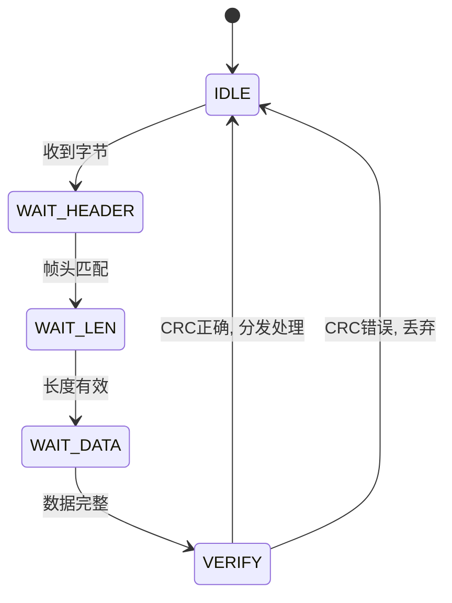
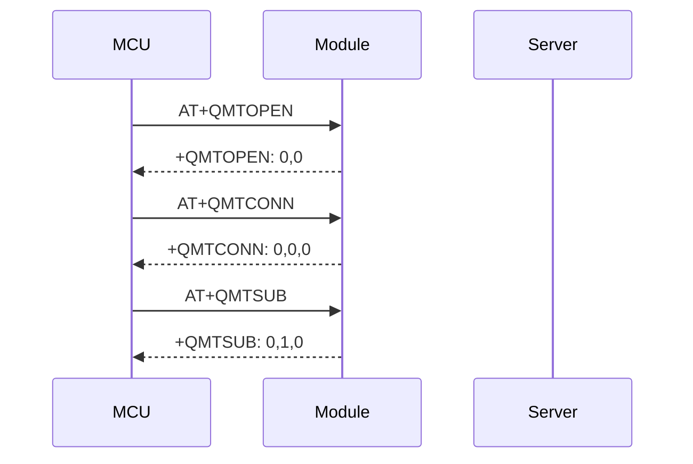

# 子Skill 5: 生成 05_通信协议.md

> **职责**: 读取分析结果，生成通信协议详细文档。
> **输入**: `_analysis/protocol_analysis.md`, `_analysis/peripheral_config.md`
> **输出**: `05_通信协议.md`

---

## 必须遵守的共享规则

开始前先读取:
- `shared/iron_rules.md` — 铁律规则（特别注意铁律1"命令字必须解析到数值"）
- `shared/format_spec.md` — 排版规范

---

## 执行前：判断运行模式

### 模式判断
1. 检查目标文档是否存在（`05_通信协议.md`）
2. 存在 → **补厚模式**：读取现有文档，只补充缺失内容
3. 不存在 → **全新生成模式**：从零开始生成

### 补厚模式操作规则
- 读取现有文档，记录"已有哪些章节/内容"
- 与本子skill的"应有内容"对比，找出缺失项
- 只追加缺失内容，不修改已有内容
- 在追加内容前加注释：`<!-- 补充于 [日期] -->`（可选）
- 执行完成后输出操作摘要

### 数据读取规则（全新/补厚均适用）
1. 先读 `_analysis/protocol_analysis.md` → 了解有哪些源文件需要读
2. 直接打开 `_v10_snapshot/sources/` 中的源文件
3. 从源码提取完整数据（数值必须有 源文件:行号 来源）
4. `_analysis/` 只作为导航，文档中所有数据来自源码

---

## 文档结构

### 对每种通信协议一个大章节

数据来源: `_analysis/protocol_analysis.md`

#### 1. 协议标准身份

标准协议? 自定义? MQTT? AT指令? Modbus?

#### 2. 帧结构

字节级描述，用表格:

| 偏移 | 长度 | 名称 | 说明 | 示例值 |
|------|------|------|------|--------|
| 0 | 1 | 帧头 | 固定 | 0xAA |
| 1 | 1 | 长度 | 数据段长度 | 0x05 |
| ... |

#### 3. 命令字/端点号表

**必须包含实际数值列**（铁律1）:

| 命令名 | 数值 | 方向 | 功能 | 来源 |
|--------|------|------|------|------|
| CMD_HEARTBEAT | 0x01 | 上行 | 心跳包 | protocol.h:25 |
| ... |

#### 4. 状态机

**必须用 Mermaid stateDiagram-v2 可视化**:

同时保留文字描述（图+文字互补）:
- 列出每个状态和对应的代码 switch/case 分支
- 标注转换条件和动作
- 标注源文件:行号

#### 5. 校验方式

CRC/累加和/XOR 等，标注校验算法所在的函数和行号。

#### 6. 超时/重试/重连机制

- 超时时间
- 重试次数
- 重连策略
- 相关参数的来源文件:行号

#### 7. 收发数据处理链

ISR → 缓冲区 → 解析 → 业务处理 的完整链路描述。

#### 8. MQTT连接建立 (如适用)

**必须用 Mermaid sequenceDiagram**:

---

## 回查要求

如果 `_analysis/protocol_analysis.md` 中缺少某个协议的状态机或命令字表:
1. 回到 `_v10_snapshot/sources/` 读取对应协议文件
2. 搜索 `switch`/`case` 结构提取状态机
3. 搜索 enum/define 提取命令字数值
4. 补充后标注源文件:行号
