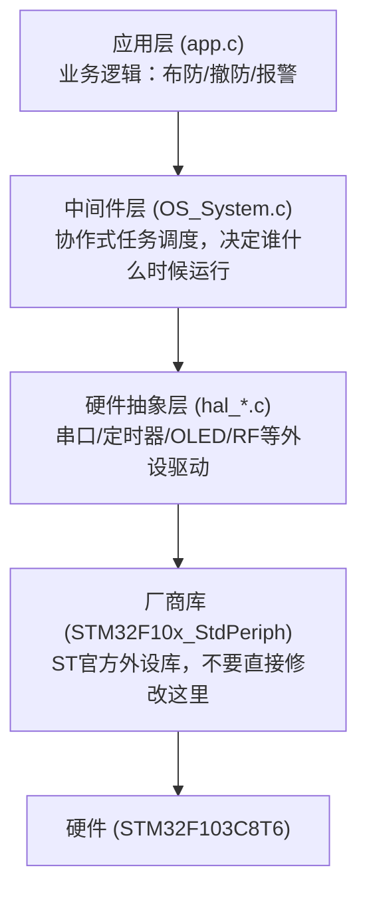

# 子Skill 10: 生成 09_项目结构总览.md

> **职责**: 面向新入职工程师，5分钟能看懂项目全貌的入门文档。
> **输入**: `_v10_context/project_context.json`, `_v10_snapshot/sources/`, `_analysis/system_init_and_tasks.md`
> **输出**: `09_项目结构总览.md`

---

## 必须遵守的共享规则

开始前先读取:
- `shared/iron_rules.md` — 铁律规则（特别注意铁律8"直接读源码"和铁律9"补厚不覆盖"）
- `shared/format_spec.md` — 排版规范

---

## 执行前：判断运行模式

### 模式判断
1. 检查目标文档是否存在（`09_项目结构总览.md`）
2. 存在 → **补厚模式**：读取现有文档，只补充缺失内容
3. 不存在 → **全新生成模式**：从零开始生成

### 补厚模式操作规则
- 读取现有文档，记录"已有哪些章节/内容"
- 与本子skill的"应有内容"对比，找出缺失项
- 只追加缺失内容，不修改已有内容
- 在追加内容前加注释：`<!-- 补充于 [日期] -->`（可选）
- 执行完成后输出操作摘要

### 数据读取规则（全新/补厚均适用）
1. 先读 `_v10_context/project_context.json`（文件清单、芯片型号）
2. 读 `_analysis/system_init_and_tasks.md`（启动流程索引）→ 了解需要读哪些源文件
3. 直接打开 `_v10_snapshot/sources/` 中各业务 .c 文件的前50行（include关系和文件职责）
4. 从源码提取完整数据（数值必须有 源文件:行号 来源）
5. `_analysis/` 只作为导航，文档中所有数据来自源码

---

## 文档结构（6个必须章节）

### 第1节：项目是什么（必须是新人能看懂的语言）

```markdown
## 项目是什么

{1-3句话，用"这个项目是一个XX设备，能做YY，用ZZ芯片控制"这样的句式}

**硬件平台**：{芯片型号} / {操作系统类型} / {主频}
**代码规模**：约 {N} 行业务代码，{M} 个模块
```

**数据来源**: 从 `project_context.json` 的 `device` 字段和源码头文件推断

### 第2节：架构分层图（核心，必须有）

用 Mermaid 展示目录层次，要有通俗中文注释：



**要求**：
- 每个框：文件名 + 一句话功能描述
- 不超过5层
- 必须基于代码实际结构，不能用通用模板
- 层次来自 include 依赖关系，不能靠猜

### 第3节：模块清单速查表

| 模块 | 文件 | 一句话职责（新人能看懂）| 初始化函数 | 先看这个函数 |
|------|------|----------------------|-----------|------------|
| 业务逻辑 | app.c | 实现布防/撤防/报警的核心状态机 | `app_Init()` | `app_TaskRun()` |
| 任务调度 | OS_System.c | 决定哪个任务在什么时候运行 | `OS_Init()` | `OS_TaskRun()` |
| ... | ... | ... | ... | ... |

**要求**：
- 覆盖所有业务 .c 文件（排除第三方库）
- 职责描述必须用非技术语言（假设读者刚毕业入职）
- 函数名必须是真实存在的，来自源码

### 第4节：系统启动流程（步骤列表，比代码更直观）

```markdown
## 系统上电后发生了什么

1. **CPU复位** → 从 Flash 0x08000000 开始执行
   → `startup_stm32f10x_md.s` 初始化堆栈和数据段

2. **时钟配置** (`system_stm32f10x.c:SystemInit`)
   → 配置 PLL，将系统时钟拉到 72MHz

3. **外设初始化** (`main.c:main`)  
   → 按顺序初始化：GPIO → USART → TIM → SPI → ...
   → （完整顺序见 03_系统架构.md）

4. **参数加载** (`para.c:Para_Init`)
   → 从 EEPROM 读取传感器配置和上次的布防状态

5. **进入主循环**
   → `OS_TaskRun()` 每 10ms 被 SysTick 触发一次
   → 按照注册顺序检查并执行各个任务
```

**数据来源**: 从 `_analysis/system_init_and_tasks.md` 获取索引，然后直接读源码确认。
每步必须标注来源（源文件:行号）。

### 第5节：新人上手建议（固定格式）

```markdown
## 新人上手建议

**今天**：读本文档 + `00_阅读指南.md`，了解项目是什么

**明天**：读 `03_系统架构.md`，搞清楚调度器怎么运转、中断关系

**第三天**：读 `04_功能模块.md`，找到你要改的模块，看它的API和调用关系

**动手前**：查 `02_硬件配置.md` 的引脚表，确认不会和其他功能冲突

**踩坑前**：先查 `07_已知问题与建议.md`，80%的坑前人已经踩过并记录了
```

### 第6节：文档导航（按受众）

```markdown
## 按身份选择阅读路径

| 身份 | 推荐阅读顺序 |
|------|------------|
| 新入职工程师 | 本文档 → 03_系统架构 → 04_功能模块 → 10_代码语义化 |
| 维护/修改工程师 | 04_功能模块 → 02_硬件配置 → 05_通信协议 → 07_已知问题 |
| 技术评审/管理层 | SUMMARY.md（一页纸） |
| 调试排查问题 | 07_已知问题与建议 → 11_常见问题清单 |
| AI问答系统 | 06_关键参数表 → 05_通信协议 → 11_常见问题清单 |
```

---

## 输出要求

- 文档面向**完全不了解项目的新人**，语言必须通俗易懂
- 所有函数名必须在源码中真实存在（不能根据命名猜测）
- 所有数值和步骤必须标注源文件:行号
- 架构图必须基于实际 include 依赖，不能套用通用模板
