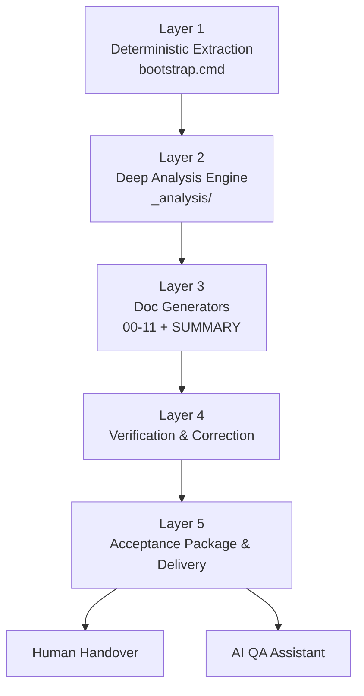
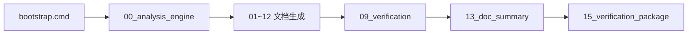

# MCU Project Organizer V13

<div align="center">

# MCU 项目知识库构建引擎 V13

**Direct-Source-First Knowledge Builder for MCU Projects**  
**面向 MCU 老项目接管、交付、QA 问答的源码直读型知识库构建 Skill**


**作者 / Author：公众号：欧工AI**

</div>

---

## What It Is / 这是什么

**EN**  
`mcu-project-organizer-v13` is an MCU project knowledge-pack builder that starts from real build context and source snapshots, then drives layered AI analysis to generate a handover-grade knowledge base.

It is designed for teams who need more than “a summary”. It aims to produce a documentation package that can:

- onboard new engineers,
- support project takeover,
- power evidence-backed QA assistants,
- and survive customer delivery review.

**中文**  
`mcu-project-organizer-v13` 是一个面向 MCU 项目的知识库构建 Skill。  
它不是“读几份摘要然后写个概览”，而是从真实构建上下文和源码快照出发，经过分层 AI 分析，最终产出可交接、可验收、可问答的项目知识库。

它的目标不是“整理一下”，而是把一个 MCU 项目真正吃透，并沉淀为：

- 新人可接手的文档资产
- 老项目可移交的知识资产
- AI 可直接引用的问答资产
- 客户可验收的交付资产

---

## Why V13 / 为什么是 V13

**EN**  
V13 is a major step beyond summary-driven pipelines.  
Its core principle is simple: `_analysis/` is only a navigation layer, while real facts must be re-confirmed from source code.

**中文**  
V13 的关键升级，不是多了几个文档，而是修正了很多旧流程的根本问题：  
`_analysis/` 只负责导航，不负责代替事实；真正的关键参数、调用链、协议细节，必须回到源码中确认。

### Core Upgrades / 核心升级

- **Direct-source-first**: analysis outputs guide the read path, but final facts come from source.
- **Dual-mode workflow**: supports both first-time full generation and selective document enrichment.
- **12+1 output set**: expanded from classic engineering docs to onboarding, semantics, FAQ, and one-page summary.
- **Verification loop**: delivery is not complete until verification and acceptance package pass.

- **源码直读优先**：分析结果只做索引，最终事实仍需回读源码。
- **双模式工作流**：既支持首次全量生成，也支持单文档补厚。
- **12+1 文档体系**：不仅有传统技术文档，还新增新人总览、代码语义化、FAQ、SUMMARY。
- **验证闭环**：不是“写完就算结束”，而是要经过验证与验收包校验。

---

## Architecture / 架构图



### Five Layers / 五层结构

1. `bootstrap.cmd` 提取项目上下文、源码快照、调用提示  
2. `00_analysis_engine` 生成 `_analysis/` 中间导航索引  
3. 文档子 skill 输出 12+1 知识库文档  
4. 验证子 skill 进行完整性与正确性检查  
5. 验收包子 skill 生成交付质量证明

---

## Output System / 输出体系

### Final Deliverables / 最终交付物

```text
00_阅读指南.md
01_项目介绍.md
02_硬件配置.md
03_系统架构.md
04_功能模块.md
05_通信协议.md
06_关键参数表.md
07_已知问题与建议.md
08_数据流与控制流.md
09_项目结构总览.md
10_代码语义化.md
11_常见问题清单.md
SUMMARY.md
验收包.md
```

### Why These Matter / 为什么这些文档重要

- `00~08`：构建基础工程认知
- `09`：让新人 10 分钟内知道项目怎么分层
- `10`：把公开函数和关键接口讲成人话
- `11`：把高频问题提前变成 FAQ 缓存
- `SUMMARY.md`：一页纸看懂项目全貌
- `验收包.md`：证明这不是“看起来像文档”的交付，而是可验证的交付

---

## Quick Start / 快速开始

### Mode A: Full Build / 模式 A：首次全量构建

```bat
bootstrap.cmd "E:\path\to\project" "E:\path\to\output"
```

然后在 AI 工具里按以下方式调用：

```text
请读取 SKILL.md，对 [项目路径] 执行完整知识库构建流程。
```

### Mode B: Enrich One Document / 模式 B：单文档补厚

```text
请读取 sub-skills/05_doc_protocols.md，
补厚 [知识库路径] 的 05_通信协议.md
```

### Mode C: Re-run Analysis Engine / 模式 C：重跑分析引擎

```text
请读取 sub-skills/00_analysis_engine.md，
重新分析 [知识库路径]，刷新 _analysis/ 索引
```

---

## Recommended Flow / 推荐执行流



### Practical Rule / 实战原则

- 第一次做项目整理：走完整流程
- 源码变化较大：先重跑分析引擎
- 某个文档不满意：只补厚对应子 skill
- 交付前：必须生成验收包

---

## Inputs / 输入要求

**EN**
- Local MCU project
- Accessible build files and source files
- Writable output directory
- Supported extraction context from Keil / IAR style projects

**中文**
- 本地 MCU 工程
- 可访问的构建文件与源码
- 可写输出目录
- 适配 Keil / IAR 风格工程上下文提取

---

## Core Principles / 核心原则

### 1. Analysis Is Navigation, Not Truth

`_analysis/` 的价值在于导航，而不是替代源码。  
如果问题涉及精确值、链路、时序、协议细节，必须回源。

### 2. Enrichment Should Improve, Not Destroy

补厚是“增量增强”，不是粗暴覆盖。  
好的内容应被保留，缺失内容应被补全。

### 3. Delivery Requires Verification

没有验证与验收包的输出，只能叫“草稿”，不能叫“交付”。

---

## Typical Use Cases / 典型场景

- MCU 老项目知识接管
- 企业内部项目移交
- 新工程师 onboarding
- 客户交付型项目文档整理
- 为 `mcu-qa-assistant` 准备高可信问答底座

---

## File Map / 关键文件地图

```text
SKILL.md                     主编排器
bootstrap.cmd               一键提取入口
scripts/                    提取与验证脚本
sub-skills/                 分阶段子 skill
shared/                     共享铁律、格式规范、质量清单
```

---

## Best Pairing / 最佳搭配

**EN**  
This skill is best used together with `mcu-qa-assistant-v5`.  
V13 builds the project knowledge base; QA Assistant uses that knowledge base to answer questions with evidence-first routing.

**中文**  
这个 skill 最适合与 `mcu-qa-assistant-v5` 配合使用。  
V13 负责把项目整理透，QA Assistant 负责基于知识库进行高可信问答。

---

## Author / 作者

**公众号：欧工AI**

If you want, I can also generate:

1. an operator-only quickstart README  
2. a customer-facing delivery README  
3. a prettier banner-style cover for this page
