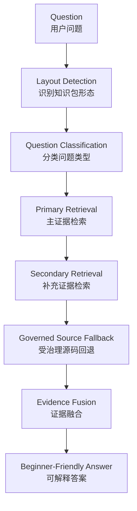
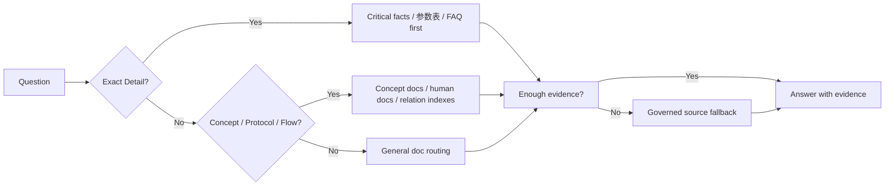

# MCU QA Assistant V5

<div align="center">

# MCU 项目问答引擎 V5

**Evidence-First QA Assistant for MCU Knowledge Packs**  
**面向 MCU 知识包的证据优先问答 Skill**


原创作者公众号：欧工AI 微信：603311638

</div>

---

## What It Does / 它是做什么的

**EN**  
`mcu-qa-assistant-v5` is an evidence-first MCU project QA skill.  
It does not answer by intuition. It answers by reading the right layer of project evidence in the right order.

**中文**  
`mcu-qa-assistant-v5` 是一个面向 MCU 项目的证据优先问答 Skill。  
它的核心不是“模型猜得像不像”，而是“按正确顺序读取正确证据，再给出结论”。

它适合回答：

- 项目里某个参数到底是多少
- 某个协议帧怎么定义
- 某个模块为什么这么实现
- 某个中断 / 任务 / 状态机如何联动
- 某个现象应该从哪里开始排查

---

## Why It Feels Strong / 为什么它会显得很强

**EN**  
Because it is not a generic chatbot with MCU vocabulary.  
It is a routed QA engine with pack-layout recognition, layered retrieval, exact-detail prioritization, and governed source fallback.

**中文**  
因为它不是“懂一点 MCU 的聊天机器人”，而是一个带检索路由能力的问答引擎：

- 先识别知识包形态
- 再判断问题类型
- 再决定检索顺序
- 最后才决定是否进入源码回退

这就是它比普通问答更稳的原因。

---

## Retrieval Philosophy / 检索哲学

### The Core Rule / 核心规则

> Do not free-scan the raw repo first.  
> 先用知识包回答，知识包不够，再进入受治理的源码分析。

这条规则非常关键，因为它决定了这个 skill 的回答风格是：

- 优先项目知识，而不是泛化常识
- 优先证据链，而不是主观猜测
- 优先最小必要读取，而不是无边界扫描

---

## Architecture / 架构图



---

## Supported Pack Layouts / 支持的知识包形态

### Layout A / B

适用于 V4 / V6 / 当前 V8 / V9 风格知识包，核心特征是：

- `06_knowledge/`
- `machine_index/`
- 可选 `08_ai_enrichment/`
- 可选 `09_source_snapshot/`

### Layout C

适用于 `mcu-project-organizer-v10` 生成的平铺 Markdown 知识包。

### Layout D

适用于 `mcu-project-organizer-v11`，在 V10 文档基础上增加 `_v10_snapshot/sources/`。

### Layout E

适用于 `mcu-project-organizer-v13`，在 V11 基础上新增：

- `09_项目结构总览.md`
- `10_代码语义化.md`
- `11_常见问题清单.md`
- `SUMMARY.md`

---

## Routing Strategy / 路由策略



### In Plain Language / 用人话解释

- 精确值问题，优先查参数表和 canonical facts
- 协议 / 算法 / 时序问题，优先走 concept-first 路由
- 文档足够回答，就不碰源码
- 文档不够，再进入受治理源码回退

---

## Typical Question Types / 典型问题类型

### Detail-First Questions / 细节优先问题

- 超时是多少
- 重试次数是多少
- 默认值是什么
- 周期 / 频率 / 阈值是多少

### Concept-First Questions / 概念优先问题

- 某个协议帧如何定义
- 某个数据流是如何走的
- 某个任务为什么这么调度
- 某个模块的职责边界是什么

### Debug / Verification Questions / 调试验证问题

- 某现象最先看哪里
- 某错误应该如何定位
- 为什么这个值和预期不一致

---

## Read Order / 必读顺序

使用这个 skill 时，先读这些规则文件：

1. `references/OUTPUT_STYLE_GUIDE.md`
2. `references/PROJECT_PACK_LAYOUT.md`
3. `references/V8_PACK_LAYOUT.md`
4. `references/QUESTION_CLASSIFIER.md`
5. `references/LAYERED_RETRIEVAL.md`
6. `references/CODE_ANALYSIS_FALLBACK.md`
7. `references/OBJECT_RETRIEVAL.md`
8. `V4_V8_RETRIEVAL_ADDENDUM.md`
9. `references/RESULT_FUSION.md`
10. `references/CONTEXT_COMPRESSION.md`
11. `V10_FLAT_MD_ADDENDUM.md`
12. `V11_SOURCE_FALLBACK_ADDENDUM.md`
13. `V13_PACK_ADDENDUM.md`

然后只打开当前问题真正需要的文件。

---

## Quick Start / 快速开始

### Example Prompt / 示例调用

```text
请读取 SKILL.md，
基于这个知识包回答：系统上电后串口初始化顺序是什么？
```

### Another Example / 再举一个

```text
请读取 SKILL.md，
基于这个 V13 知识包回答：某个超时参数默认值是多少，证据来自哪里？
```

### Best Practice / 最佳实践

- 用户给完整 run root：自动识别 `06_knowledge`、`08_ai_enrichment`、`09_source_snapshot`
- 用户给 `06_knowledge/`：自动寻找兄弟目录
- 用户给 V10/V11/V13 平铺文档目录：先识别 Layout C/D/E 再检索

---

## Hard Rules / 硬规则

1. 项目问题优先用项目知识，不优先用公域常识。  
2. `source_snapshot` 是 fallback，不是第一层。  
3. `core_concept_type_templates.md` 不能当项目事实。  
4. 不能只凭 `kb_version` 判断知识包能力。  
5. 如果证据不足，必须明确说“不确定”。  
6. 代码与注释冲突时，以当前目标代码行为为准。  
7. 最终回答里要区分“直接证据 / 推断 / 建议”。  

---

## Success Standard / 成功标准

这个 skill 用得正确时，应该做到：

- 能自动识别 V10 / V11 / V13 / V4-V9 风格知识包
- 精确值问题优先走 detail-first 路由
- 协议和链路问题优先走 concept-first 路由
- 文档够用时不乱扫源码
- 文档不够时进入受治理源码回退
- 回答始终保持“对新手友好，但不胡说”

---

## Best Pairing / 最佳搭配

**EN**  
This skill pairs naturally with `mcu-project-organizer-v13`.  
Organizer builds the knowledge base; QA Assistant consumes it with routed evidence-first answering.

**中文**  
这个 skill 与 `mcu-project-organizer-v13` 是天然搭配：

- Organizer 负责“把项目整理透”
- QA Assistant 负责“把知识用起来”

---


If you want, I can continue with:

1. a slimmer operator README  
2. a customer-facing README  
3. a visual banner cover for this QA skill
